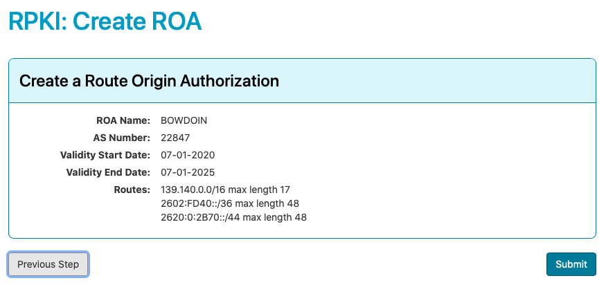

# RPKI

Resource Public Key Infrastructure ([RPKI]), is a system where
we publish authoritative, signed statements, called Route Origin
Authorizations ([ROA]s), so that other network providers may perform
route origin validation on any annoucements they receive for these
prefixes.

We use the [Hosted RPKI] service provided by our RIR, [ARIN].

<!-- vim-markdown-toc GFM -->

- [Prepare requirements](#prepare-requirements)
  - [List networks to assign](#list-networks-to-assign)
  - [Generate ROAs](#generate-roas)
- [Set up Hosted RPKI with ARIN](#set-up-hosted-rpki-with-arin)
- [Submit ROAs to ARIN](#submit-roas-to-arin)
- [Documentation Resources](#documentation-resources)

<!-- vim-markdown-toc -->

## Prepare requirements

### List networks to assign

Verify the `nets.json` file lists the `prefix`, `length`, and
(optionally) `maxlength` for each network you want to include in the
ROA(s).

### Generate ROAs

Run the `genroa.sh` script to create the [RPKI] signing key, generate
[ROA]s and sign them.  By default, the script will use the [our
ASN](https://bgp.he.net/AS22847) and a ROA name of "BOWDOIN", but these
can be modified on the commandline.  The script will first try to
retrieve the organization keypair from 1Password.  If not available, it
will generate a new one and upload to 1Password as a new document in the
Networking vault.

<!-- markdownlint-disable MD013 -->
    $ ./genroa.sh
    Please sign in to 1Password to retrieve private key.
    Enter the password for jlavoie@bowdoin.edu at bowdoin.1password.com:
    Retrieving orgkeypair.pem from 1Password as ARIN RPKI key pair document.
    Extracting public key org_pubkey.cer from keypair orgkeypair.pem
    writing RSA key
    Please add the following to the ARIN hosted RPKI interface for BOWDOI-1
    -----BEGIN PUBLIC KEY-----
    MIIBIjANBgkqhkiG9w0BAQEFAAOCAQ8AMIIBCgKCAQEA7lcgdbgmbkJbmsRN3DQ4
    tycwRc9pQ/NDVE+aMz4IW/Jy6R28NKmlNO2vhKzUEosVZpDXOuxe5tYduirP82BS
    gkx0Io3XH+b+ZUFuGOhUaqSTcvvCD7ga7A4VxyLMnDvE6lqKLTIhjnYcecJ3ccUL
    WcooGNBQyL8ClOcSYfCMbY1xXflSrKs0Oki6TR3Q+XrQxtV6xPjP0bpoqNgmG3PH
    vBk7WZbsAnWC5Jhi1npRMpPat2MA8IxulSTyiEfUP4v28fAn0nSVY/NuObjaVmmI
    vhuqKfn8Sf2hVvqLSzvfJjQ1Q//y2pitIw+Ahlht7urCIhvGXfw/MNDUPXKoNg8z
    uwIDAQAB
    -----END PUBLIC KEY-----

    Please add the following ROA to ARIN's "create ROA" interface.
    -----BEGIN ROA REQUEST-----
    1|1593630254|BOWDOIN|22847|07-01-2020|07-01-2025|139.140.0.0|16|17|2602:FD40::|36|48|2620:0:2B70::|44|48|
    -----END ROA REQUEST-----
    -----BEGIN SIGNATURE-----
    k2p4N/NzECOO0h1ve7ZPSVYErsqbCslR90bisvWCrBE2FN/IF0U50q7+AHwsfvEm
    5/g9YaZTbE/s5QHjH84NGJDi1F/7t/i+SDy027nfCdhGJb92OSBSg9Siz6xBMdod
    aqGVNbkYeAsVApvO1Gh3GRqIATaa16/EDnDYz2OjqppoWzkKvZHjbk09LWSLXo5x
    5qZ2+PpW3LucQIchMwEBvbOZY3ul/y/KglcYrOpHD8/2D+LGXPOltCUL19xJXInD
    8jCY4YuAiueMm22buJD1q7rG4w9Hd1HQxuKY3cHMCQSVYKgn0HP3V5TKQ5KD7HU4
    dR8nyjEQF+zDogRKQh0KiQ==
    -----END SIGNATURE-----
<!-- markdownlint-enable MD013 -->

The output will be used in the following steps.

## Set up Hosted RPKI with ARIN

On the [ARIN website](https://account.arin.net/public/secure/org) select
the organization to add the hosted key.  Repeat the following
process for each region and cloud provider.

- Click on "Actions" and "Manage RPKI"

This is one-time process for the organization.  If you
see the RPKI "Status Overview" page, this task has
already been completed.
If so, please skip to [submitting ROAs](#submit-roas-to-arin).

- Click on "Configure Hosted"

- Paste the public key from the `genroa.sh` output.
- Click "Submit". This generates a ticketed request for ARIN
  to generate a resource certificate covering your Internet number
  resources. You’ll receive a notification in ARIN Online of any
  actions regarding your request.

## Submit ROAs to ARIN

On the [ARIN website](https://account.arin.net/public/secure/org) select
the organization to add the ROAs.

- Click on "Actions" and "Manage RPKI"
- Choose "Create ROA"
- In the "Create a Route Authorization" dialog, choose "Signed"

- Paste one of the signed ROAs from the `genroa.sh` output
  (including `-----BEGIN ROA REQUEST-----` through `-----END SIGNATURE-----`)
  into the "Signed ROA Request:" textfield.
- Choose "Next Step"

- Choose "Submit"
- A "Create ROA" ARIN ticket will be automatically created and processed,
  typically within a couple minutes.

Repeat the process for each signed ROA.

## Documentation Resources

[RPKI documentation][RPKI]

[ARIN's Route Origin Authorization (ROA) documentation][ROA]

[RPKI]: https://rpki.readthedocs.io/en/latest/index.html
[ROA]: https://www.arin.net/resources/manage/rpki/roa_request/
[ARIN]: https://www.arin.net/
[Hosted RPKI]: https://www.arin.net/resources/manage/rpki/hosted/
